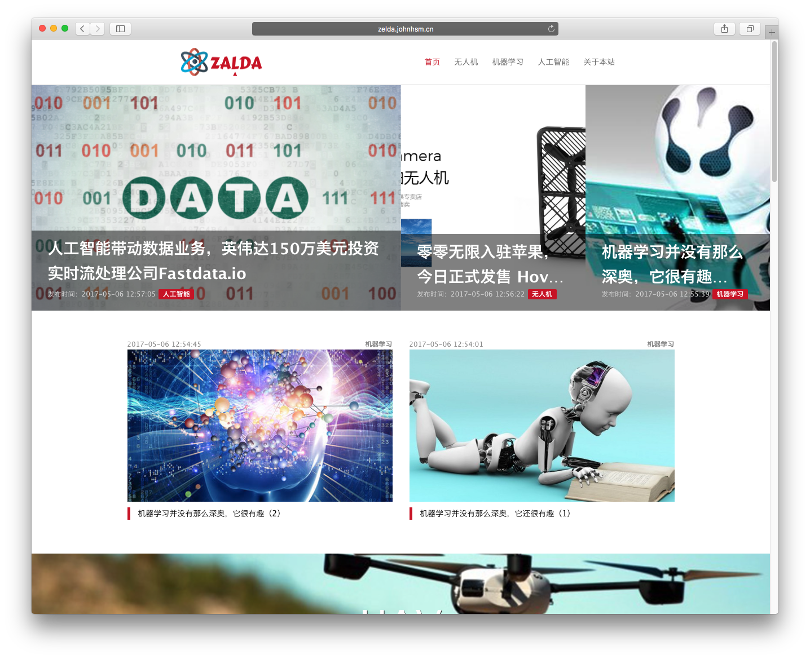
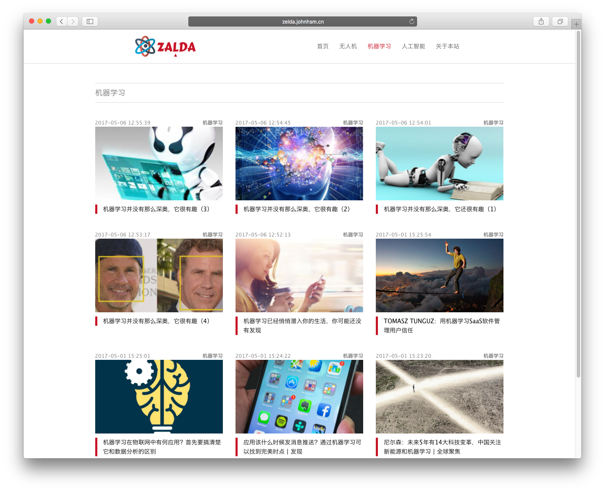
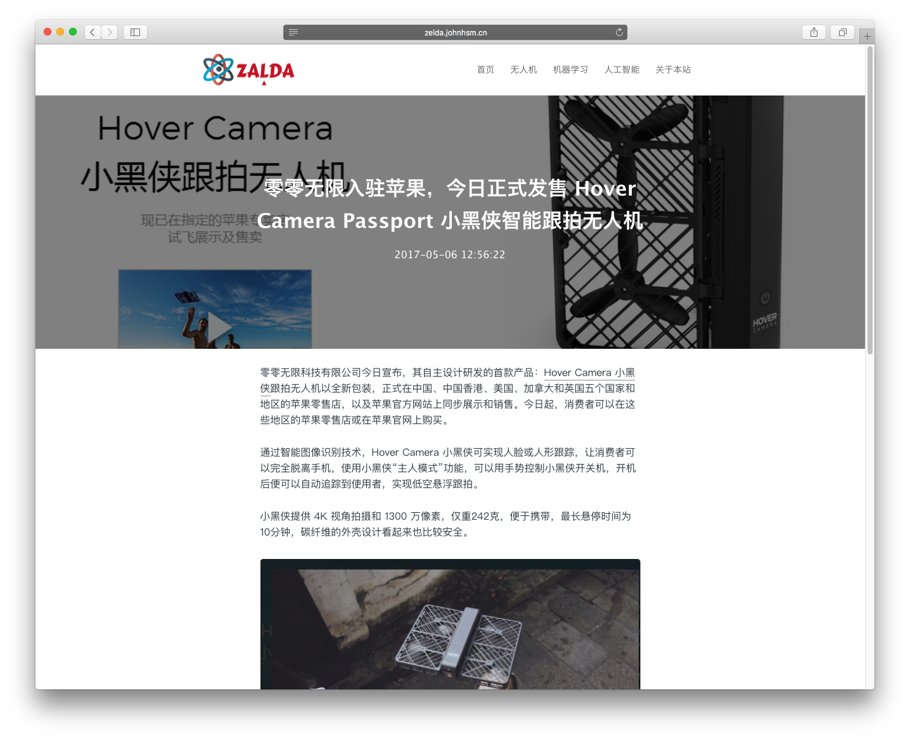
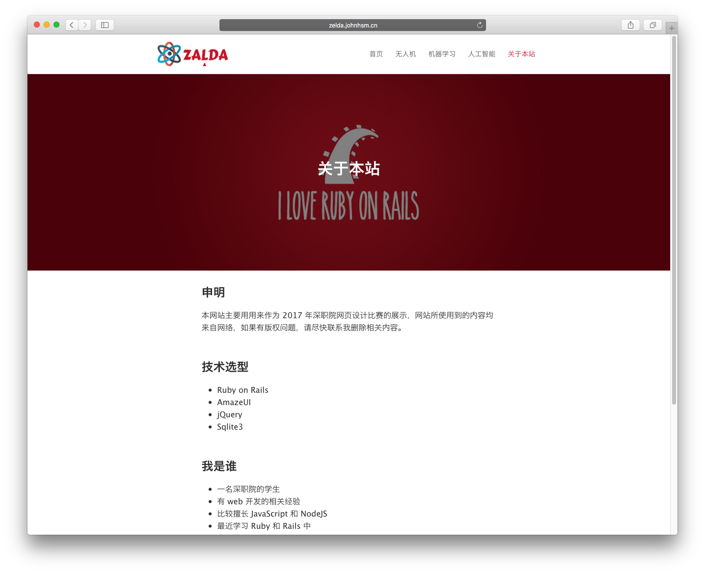

# 介绍

本网站主要用用来作为 2017 年深职院网页设计比赛的展示，网站所使用到的内容均来自网络，如果有版权问题，请尽快联系我删除相关内容。

线上访问链接：[ZELDA](http://zelda.johnhsm.cn/)

# 截图






# 技术栈

## 前端

 - AmazeUI
 - jQuery
 - UEditor

## 后端

 - Ruby
 - Ruby on Rails
 - Sqlite3

# 启动项目

## 前言

开发环境建议使用 vagrant 或者在 macOS 下开发，**不建议在 windows 下开发**。

安装环境可以参考以下链接：

 - [rbenv 使用指南](http://ruby-china.org/wiki/rbenv-guide)
 - [如何在 Mac下快速部署 Nginx + Passenger + Rails](http://ruby-china.org/wiki/mac-nginx-passenger-rails)

## 开发环境

```
$ git clone https://github.com/q545244819/zelda-website.git
$ cd zelda-website
$ rails s -b 0.0.0.0
```

然后访问`http://127.0.0.1:3000`，你就能看到页面了。

## 生产环境

```
$ git clone https://github.com/q545244819/zelda-website.git
$ cd zelda-website
$ RAILS_ENV=production rake db:create
$ RAILS_ENV=production rake db:migrate
$ RAILS_ENV=production rake assets:precompile
$ puma -C config/puma_production.rb
```

然后访问`http://127.0.0.1:8080`，你就能看到页面了。

# 其他

 - '/admin' 后台登录页面，首次访问会让你先设置账号和密码；
 - 目前只有三个分类：无人机、机器学习和人工智能；
 - 部署到生产环境请自行配置 ngnix 等。